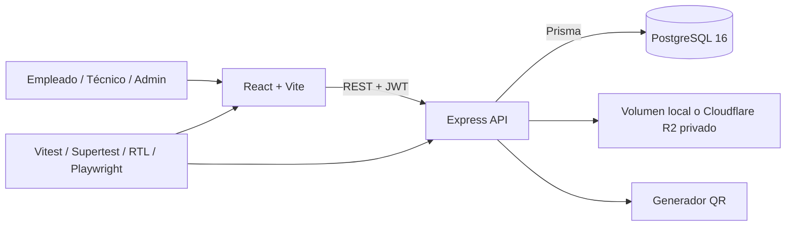

# SoporteQR

MVP profesional para gestionar activos informáticos e incidencias técnicas mediante códigos QR. Está pensado para clínicas, colegios, oficinas y PyMEs; no almacena datos clínicos ni información de pacientes.

## Qué demuestra

- React y TypeScript con rutas protegidas, TanStack Query, formularios validados y gráficos Recharts.
- API REST con Express, PostgreSQL, Prisma, JWT, refresh cookie HttpOnly y RBAC.
- Flujo completo: empleado reporta, técnico se asigna y resuelve, empleado recibe una notificación y administración consulta métricas y auditoría.
- Gestión de usuarios, ubicaciones, categorías, activos, tickets, adjuntos y etiquetas QR.
- Swagger/OpenAPI, Supertest, React Testing Library, Playwright y GitHub Actions.

## Requisitos

- Node.js 20 o superior.
- Docker Desktop con WSL 2 activo en Windows.
- Git.

## Instalación desde cero

En PowerShell:

```powershell
git clone <URL_DEL_REPOSITORIO>
cd soporteqr
npm install
Copy-Item .env.example apps/api/.env
docker compose up -d
npm run db:deploy
npm run db:seed
npm run dev
```

En Linux o macOS, reemplazar `Copy-Item` por:

```bash
cp .env.example apps/api/.env
```

Abrir:

- Frontend: [http://localhost:5173](http://localhost:5173)
- Presentación pública: [http://localhost:5173/presentacion](http://localhost:5173/presentacion)
- API: [http://localhost:4000/api/health](http://localhost:4000/api/health)
- Swagger: [http://localhost:4000/api/docs](http://localhost:4000/api/docs)

## Usuarios de demostración

Contraseña común de desarrollo: `Demo1234!`

| Rol           | Usuario                   |
| ------------- | ------------------------- |
| Administrador | `admin@soporteqr.demo`    |
| Técnico       | `tecnico@soporteqr.demo`  |
| Empleado      | `empleado@soporteqr.demo` |

Estas credenciales son exclusivamente locales y no deben utilizarse en producción.

## Comandos

```bash
npm run dev          # API y frontend
npm run build        # build de los tres workspaces
npm run lint         # ESLint API + web
npm run test         # Supertest/Vitest + RTL
npm run test:e2e     # Playwright, flujo vertical completo
npm run db:deploy    # aplica migraciones existentes
npm run db:migrate   # crea migraciones durante desarrollo
npm run db:seed      # restablece datos demo
```

Los tests de API y Playwright usan el esquema PostgreSQL `integration_test`; el esquema de desarrollo no se modifica.

## Flujo principal

1. El empleado inicia sesión y crea un ticket para un activo identificado por QR.
2. Un técnico se asigna el ticket y lo mueve a `EN_PROGRESO`.
3. Registra diagnóstico y solución y lo marca `RESUELTO`.
4. El empleado recibe una notificación.
5. El administrador observa el impacto en dashboard y auditoría.

## Arquitectura



El modelo de datos y los límites de seguridad están detallados en [docs/architecture.md](docs/architecture.md).

## Seguridad y decisiones de diseño

- Contraseñas con Argon2.
- Access token corto y refresh token en cookie HttpOnly.
- Helmet, CORS explícito, rate limiting y validación Zod.
- Autorización por rol aplicada en backend.
- Multiempresa mediante `organizationId`.
- Los usuarios y activos con historial se desactivan o dan de baja; no se destruye trazabilidad.
- Ubicaciones y categorías sólo pueden eliminarse si no tienen dependencias.
- Los QR exponen `publicAssetCode`, nunca el identificador interno.

## Pruebas

- `apps/api/src/vertical-flow.test.ts`: login de los tres roles, creación, asignación, estados, notificación y auditoría sobre PostgreSQL real.
- `apps/web/e2e/vertical-flow.spec.ts`: el mismo circuito desde Chromium.
- RTL: login, alta de ticket y dashboard.
- `apps/api/src/app.test.ts`: health, Swagger, CORS y protección de endpoints.

## Despliegue

Para producción se recomienda separar frontend, API, PostgreSQL y almacenamiento de adjuntos. Configurar secretos reales, HTTPS, `NODE_ENV=production`, un origen CORS único y almacenamiento persistente. Aplicar migraciones con `npm run db:deploy`; no ejecutar el seed demo. La arquitectura y la lista de control para publicar la demostración están en [docs/deployment-demo.md](docs/deployment-demo.md), junto con un [guion reproducible de cinco minutos](docs/demo-5-minutos.md).

La configuración de Cloudflare R2, backups cifrados y probados, restauración, readiness y alertas está documentada en [docs/operations.md](docs/operations.md).

## Estructura

```text
apps/api       API Express, Prisma, Swagger y Supertest
apps/web       React, RTL y Playwright
packages/shared tipos, enums y esquemas Zod compartidos
docs           arquitectura y material para portfolio
```
