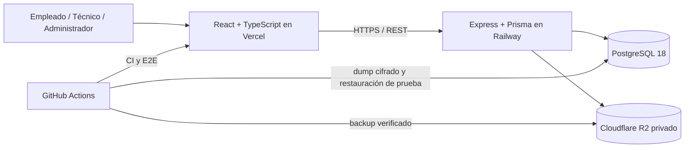

# SoporteQR

Sistema web para gestionar activos informáticos e incidencias técnicas mediante códigos QR. Vincula cada reporte con el equipo, su ubicación y su historial; luego aplica triaje automático, permisos por rol y métricas operativas para ordenar el trabajo de soporte.

[Ver demostración](https://soporteqr-web.vercel.app/presentacion) · [API operativa](https://soporteqrapi-production.up.railway.app/api/health/ready) · [Documentación técnica](docs/architecture.md)

## El problema

Un reporte como “la impresora no funciona” obliga a soporte a reconstruir información básica: qué equipo es, dónde se encuentra, quién lo reportó y qué fallas tuvo antes. SoporteQR conserva ese contexto desde el QR pegado en el activo hasta la resolución y la auditoría final.

## Qué se puede probar

La demo pública permite ingresar con tres perfiles preconfigurados:

- **Empleado:** reporta una incidencia y consulta únicamente sus propias solicitudes.
- **Técnico:** revisa la cola operativa, se asigna casos, registra diagnóstico y resolución.
- **Administrador:** administra activos y catálogos, consulta auditoría, métricas, SLA y carga técnica.

El circuito principal incluye escaneo QR, identificación del activo, triaje automático de categoría y prioridad, asignación, cambios de estado, comentarios, adjuntos, notificaciones e historial.

## Decisiones destacadas

- La prioridad no depende del criterio del empleado: se calcula a partir de impacto, interrupción, alternativa disponible y señales de riesgo.
- Los empleados sólo reciben sus propios tickets; técnicos y administradores acceden según permisos aplicados también en backend.
- El QR publica un código aleatorio del activo, nunca su identificador interno.
- Los adjuntos se guardan en un bucket privado de Cloudflare R2 y se descargan únicamente después de autorizar la solicitud.
- PostgreSQL tiene backups diarios cifrados; cada copia se restaura en una base aislada antes de subirse a R2.
- La disponibilidad de web, API, base y almacenamiento se controla automáticamente cada 15 minutos.

## Arquitectura



## Tecnologías

| Área | Implementación |
| --- | --- |
| Frontend | React, TypeScript, Vite, TanStack Query, React Hook Form, Zod, Recharts |
| Backend | Express, Prisma, PostgreSQL, JWT, Argon2, Swagger/OpenAPI |
| Almacenamiento | Cloudflare R2 mediante API compatible con S3 |
| Calidad | Vitest, Supertest, React Testing Library, Playwright, ESLint |
| Operación | Vercel, Railway, GitHub Actions, readiness, uptime y backups cifrados |

## Ejecutar localmente

Requisitos: Node.js 20+, Docker Desktop y Git.

```powershell
git clone https://github.com/cristalba22/soporteqr.git
cd soporteqr
npm install
Copy-Item .env.example apps/api/.env
docker compose up -d
npm run db:deploy
npm run db:seed
npm run dev
```

En Linux o macOS, usar `cp .env.example apps/api/.env` en lugar de `Copy-Item`.

- Web: [http://localhost:5173](http://localhost:5173)
- Presentación: [http://localhost:5173/presentacion](http://localhost:5173/presentacion)
- API: [http://localhost:4000/api/health](http://localhost:4000/api/health)
- Swagger: [http://localhost:4000/api/docs](http://localhost:4000/api/docs)

La contraseña común del seed local es `Demo1234!` para `admin@soporteqr.demo`, `tecnico@soporteqr.demo` y `empleado@soporteqr.demo`. Son cuentas ficticias exclusivas del entorno demostrativo.

## Verificación

```bash
npm run lint
npm run test
npm run test:e2e
npm run build
```

- Supertest valida login de los tres roles, creación, asignación, resolución, notificación y auditoría sobre PostgreSQL.
- React Testing Library cubre login, tickets, activos y dashboard.
- Playwright recorre el flujo vertical completo desde Chromium.
- GitHub Actions ejecuta lint, pruebas y build en cada cambio.

## Alcance y privacidad

SoporteQR administra infraestructura e incidencias técnicas. No almacena historias clínicas, diagnósticos médicos ni datos de pacientes. La demo contiene solamente información ficticia.

El proyecto está preparado para portfolio y demostraciones controladas. Antes de un piloto operativo se deben completar recuperación de contraseña, sesiones administrables, notificaciones por correo, importación/exportación masiva y pruebas adicionales de aislamiento entre organizaciones.

## Autor

**Cristian Eduardo Alba** — Córdoba, Argentina

[LinkedIn](https://www.linkedin.com/in/cristian-eduardo-alba-374098240/)

Licencia MIT.
