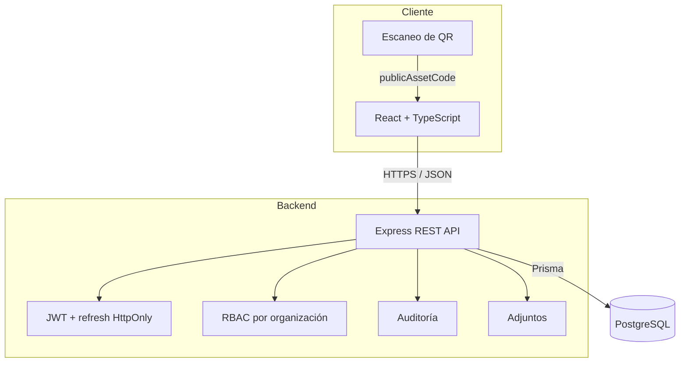
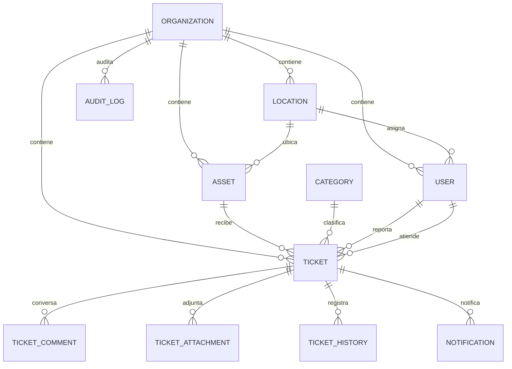
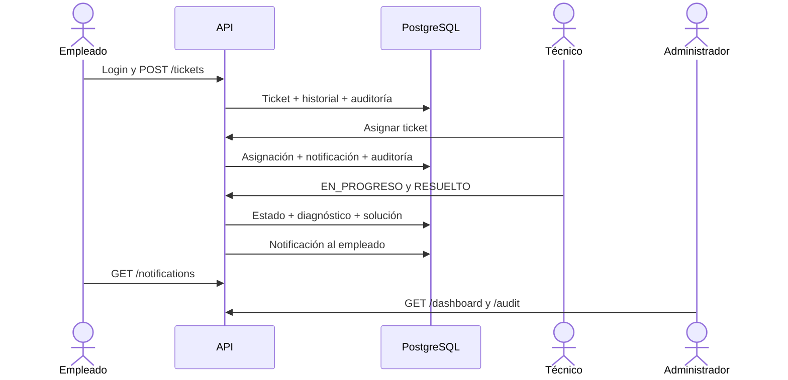

# Arquitectura de SoporteQR

## Componentes

## Modelo de dominio

## Límites de autorización

| Rol | Capacidades principales |
| --- | --- |
| Empleado | Reportar, consultar tickets propios, comentar y recibir notificaciones |
| Técnico | Consultar tickets de la organización, asignarse, diagnosticar y resolver |
| Administrador | Todo lo anterior, configuración, usuarios, métricas y auditoría |

El backend filtra siempre por `organizationId`. Las restricciones visuales del frontend no se consideran controles de seguridad.

## Flujo vertical validado

