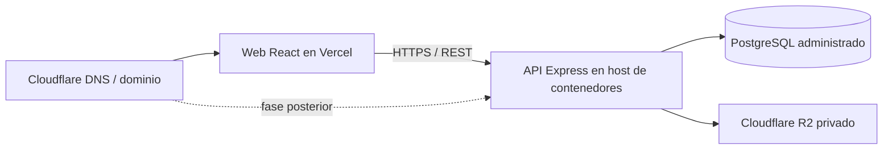

# Publicación de la demo

## Arquitectura recomendada



- **Vercel:** frontend React/Vite y URL HTTPS de la demostración.
- **Cloudflare:** almacenamiento R2 privado para adjuntos y backups cifrados; DNS y dominio propio pueden sumarse cuando se defina el dominio final.
- **API:** mantener Express como contenedor en Railway, Render, Fly.io o equivalente.
- **Datos:** PostgreSQL administrado, separado de la aplicación.

No conviene migrar la API actual directamente a Workers: depende de Express y Prisma/PostgreSQL. La publicación conserva esa arquitectura y desacopla los archivos mediante R2.

## Vercel

El repositorio ya incluye `vercel.json` para compilar el workspace web y resolver las rutas de la SPA.

1. Importar el repositorio en Vercel con la raíz del proyecto.
2. Configurar `VITE_API_BASE_URL=https://api.example.com`.
3. Desplegar y probar `/presentacion`, `/login` y una ruta profunda como `/dashboard`.
4. Asociar el subdominio público, por ejemplo `demo.soporteqr.com.ar`.

## API y PostgreSQL

Variables mínimas de producción:

```text
DATABASE_URL=<conexion PostgreSQL con SSL>
NODE_ENV=production
CORS_ORIGIN=https://demo.soporteqr.com.ar
APP_BASE_URL=https://demo.soporteqr.com.ar
JWT_ACCESS_SECRET=<secreto aleatorio largo>
JWT_REFRESH_SECRET=<otro secreto aleatorio largo>
UPLOAD_DIR=<volumen persistente>
```

En el release de la API ejecutar `npm run db:deploy` antes de iniciar `npm run start --workspace=apps/api`. Nunca copiar las credenciales demo ni secretos del entorno local.

## Lista de control antes de compartir

- HTTPS válido en web y API.
- CORS permite únicamente la URL pública.
- Cookie de refresh marcada `Secure` en producción.
- Base demo con nombres y datos ficticios.
- `/api/health` responde y los tres roles pueden iniciar sesión.
- El QR público abre la URL desplegada, no `localhost`.
- Los adjuntos sobreviven un reinicio del servicio.
- Existe una copia de seguridad restaurable de la base demo.

## Límite de esta etapa

Esta configuración alcanza para portfolio y demostraciones controladas. Los backups automáticos, el monitoreo y el almacenamiento privado ya están activos. Un piloto con una clínica requiere además recuperación de contraseña, sesiones administrables, correo, importación/exportación y pruebas adicionales de aislamiento por organización.
